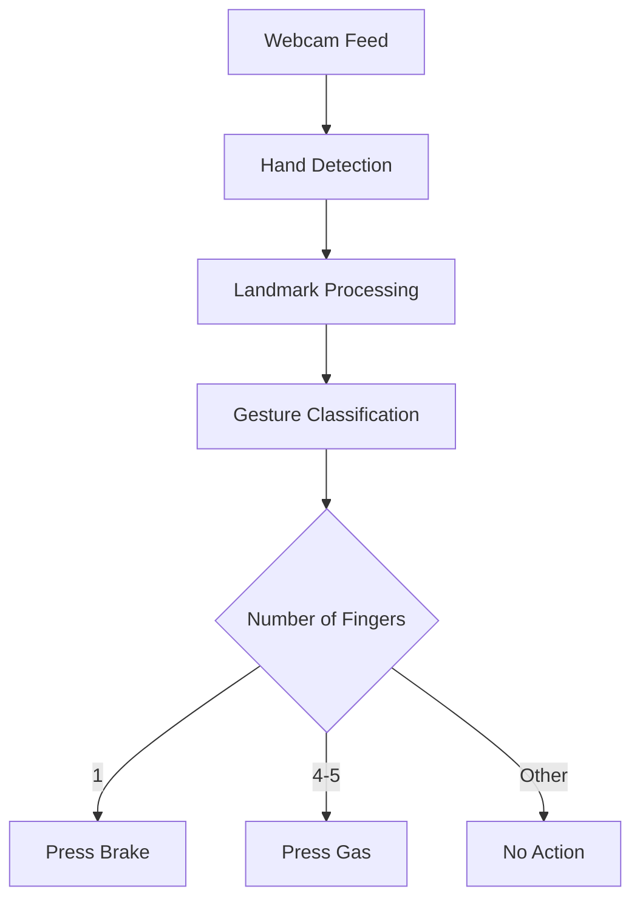

# 🚗🤖 Hand Gesture Controller 🤖🚗


## ✨ Features

- 👆 Real-time hand gesture recognition  
- 🎮 Seamless integration with racing games  
- 🖐️ Simple controls: 1 finger for brake, 4+ fingers for gas  
- 🎨 Beautiful visual feedback with transparent overlays  
- ⚡ Optimized performance with MediaPipe

## 🛠️ Technologies Used

<div align="center">

      

</div>

## 🚀 Getting Started

### Prerequisites

- Python 3.7+  
- Webcam

### Installation

1. Clone the repository  
```bash
git clone https://github.com/yourusername/hand-gesture-car-controller.git
cd hand-gesture-car-controller
```
Install dependencies

```bash
pip install -r requirements.txt
Run the application
```
```bash
python hand_controller.py
```
### 🎮 How to Use
✋ Hold up 1 finger (or a closed fist) to activate BRAKE (← key)

✋ Hold up 4 or 5 fingers to activate GAS (→ key)

❌ Press 'q' to quit the application

### 🧠 How It Works

### 🌟 Contributors
<table> <tr> <td align="center"> <a href="[https://github.com/yourusername](https://github.com/vermaarpit14)">  <br /> <sub><b>Arpit Verma</b></sub> </a> </td> </tr> </table>

### 📜 License
MIT License

### 🙏 Acknowledgments
MediaPipe team

OpenCV community

<div align="center"> Made with ❤️ and Python </div>
